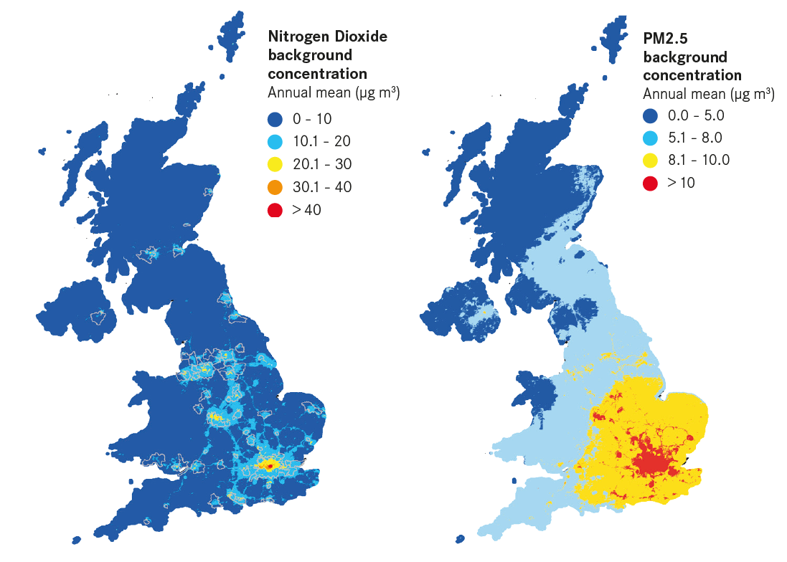

```{r include=FALSE}
library(RefManageR)
library(knitcitations)
BibOptions(check.entries = FALSE,
           bib.style = "authoryear",
           cite.style = "authoryear",
           style = "markdown",
           hyperlink = TRUE,
           dashed = FALSE,
           no.print.fields=c("doi", "url", "urldate", "issn"))
myBib <- ReadBib("./References.bib", check = FALSE)

```


# Problem Definition

.pull-left[- UN SDG 11.6: By 2030, reduce the adverse per capita environmental impact of cities, including by *paying special attention to air quality* and municipal and other waste management

- In the UK, many cities have high levels of PM2.5 and NO2 concentration.

- In the South East, this is partly due to emissions from London and Europe `r Citep(myBib, "centreforcitiesHoldingOurBreath2020")`]

```{r echo=FALSE, out.width='50%', fig.align='right'}

```
.small[[Source: Centre for Cities](https://www.centreforcities.org/reader/cities-outlook-2020/air-quality-cities/)
]


---
# Problem Definition


* Estimated cost to society of air pollution in Slough: £40m / year `r Citep(myBib, "nancarrow2019")`
* Slough is particularly badly affected: Over 6% of deaths in the city are attributable to PM2.5 pollution `r Citep(myBib, "centreforcitiesHoldingOurBreath2020")`:

```{r echo=FALSE, out.width= "75%", fig.align='center'}

```

---
# Problem Definition - Slough's Current Approach on PM2.5


* **Air Quality Action Policy** was established to be in line with UK Government's `Environment Act 1995` ([Slough Borough Council](https://democracy.slough.gov.uk/documents/s52745/Appendix%202%20-%20LES%20Technical%20Report%20Final%20Draft.pdf), 2018).


  - City's on-going measures to control and reduce PM ([Slough Borough Council](https://www.slough.gov.uk/downloads/file/160/asr-2020), 2020):
  
    - `Smoke Control Orders`
    - Acceleration of the uptake of `Ultra Low Emission Vehicles (ULEV)`
    - Promotion of `best practice dust controls` on construction sites
    - Reducing congestion by `reducing dependency on cars`


---
# Problem Definition - Slough's Urban Forest Activities


* The city currently runs two urban forest activities: 
  - `Urban Tree Challenge`: focus on NO2 and specifies 4 designated sites
  - `Digital Urban Forest`: monitoring air quality using IoT devices
  
```{r echo=FALSE, out.width= "50%", fig.show='hold', fig.align= 'center', fig.cap= "Slough's Urban Forest Programmes (Source: [Slough Borough Council](https://www.slough.gov.uk/environment/trees-hedges-1/8), n.d.)"}

knitr::include_graphics(c('images/site.png', 'images/digi.png'))
```


---
class: inverse, center, middle

#Approach
---
#Approach -  3 Types of PM Urban Forests

- `PM Blockage Urban Forests`: 1,800 trees/ha
- `PM Mitigation Urban Forests`: 800 - 1,000 trees/ha
- `Wind Corridor Urban Forests`: Less than 500 trees/ha

```{r echo=FALSE, out.width="100%", out.height="40%", fig.align='center', fig.cap="PM Urban Forest Types (Source: Edited from Korea Forest Service, n.d)"}
knitr::include_graphics('images/type.png')
```
---
#Approach - Why PM Urban Forests?

- Urban forest types tailored for PM reduction suit better 
- Increase City's Green Cover which is below national standard 20% ([Slough Borough Council](https://www.slough.gov.uk/urbantree), n.d)
- Urban Forests could achieve rather prominent decrease in PM
- Low cost

---
# Approach
## Methods - Site Suitablity Analysis
Using existing data to identify the optimal locations for future forests within and around the city of Slough, UK. 

```{r echo=FALSE, out.width='90%', out.height= '60%'}
DiagrammeR::grViz("digraph {
  
graph[layout = dot, rankdir = LR]

a [label = 'Suitable Site', shape = square, fillcolor = Black]
c [label = 'Prevlaining Wind Direction']
b [label = 'Pollution Concentration']
d [label = 'Existing infrastructure']


{b c d} -> a
}")
```


---
# Approach - Satellite products to mitigate particulate matter (PM)

Product|Temporal Resolution|Spatial Resolution|Source|Task
--------|---------|-----------|-------------
Multi-spectral imaging|10 days|10 m|Sentinel-2|land cover classification
Land Cover|Yearly|10 m|UKCEH Land Cover Maps|land cover classification
PM2.5|Real-time|-|IoT Devices by Air Quality in England|Evaluate the effect of tree cover change on PM2.5
Air Pollution|<1 day|1000m|Sentinel 5P|Identify areas of high pollution concentration
Wind speed|Monthly|10 m|ERA5|Map potential tree planting sites

---
# Approach
## 1. Evaluate the effect of tree cover change on PM2.5 in each site

.pull-left[
```{r echo=FALSE, out.width='70%', fig.align='center'}

```
Source: [UKSO](https://www.ukso.org/static-maps/land-cover-map.html)
]

.pull-right[
1. Mapping tree cover area from Sentinel-2 by conducting land cover classification
+ **Input**
  + Data: Sentinel-2 (10m)
  + Label: UKCEH Land Cover Maps (10m)
+ **Methodology**: Conduct land cover classification models such as Random Forest / SVM / CNN to locate forest areas
+ **Output**: Forest areas (10m)

]

---
# Approach
## 1. Evaluate the effect of tree cover change on PM2.5 in each site (2)

.pull-left[
```{r echo=FALSE, out.width='70%', fig.align='center'}

```
Source: [UKSO](https://www.ukso.org/static-maps/land-cover-map.html)
]

.pull-right[
2.Estimate total annual change in PM2.5 removal from urban tree cover change
+ **Input**
  + Forest areas 
  + PM2.5 monitoring data
+ **Methodology**: Conduct regression model such as linear regression or GWR for each site 
+ **Output**: average PM2.5 removal rates in each site


]

---
# Approach
## 2. Map potential tree planting sites

```{css echo=FALSE}
.left-column {
  float: left;
  width: 30%;
}
.right-column {
  float: right;
  width: 70%;
}
.small-font {
    font-size: 12px;
    padding: 0em 0em 0em 0em;
}
```

.left-column[
```{r echo=FALSE, out.width='100%', fig.align='center'}

```
]

.right-column[
1. Selected from areas with high potential to remove PM2.5
+ **Input**: site-level PM2.5 removal rates, land cover map
+ **Methodology**: We estimate total annual change in PM2.5 removal from urban tree cover change by the following equation:
```{r echo=FALSE, out.width='100%', fig.align='center'}

```
.small-font[
Where Removal(PM2.5) is total annual change in PM2.5 removal from urban tree cover change, RemovalRate(PM2.5) is site-level average PM2.5 removal rates,  ForestAreaChanges is total forest areas changes from 2010 and i refers to site i
]
+ **Output**: Potential tree planting sites to remove PM2.5
+ **Implementation**: Plant urban forests depending on distance to the city centre
]

---
# Approach
## 2. Map potential tree planting sites (2)

```{css echo=FALSE}
.left-column {
  float: left;
  width: 40%;
}
.right-column {
  float: right;
  width: 60%;
}
```

.left-column[
```{r echo=FALSE, out.width='100%', fig.align='center'}

```
Source: [Jing Wang 2021](https://www.mdpi.com/2073-4433/12/11/1428)
]

.right-column[
2.Prevailing pollution from neighbourhoods
+ **Input**
  + ERA5 (10m) 
  + PM2.5 monitoring data
+ **Methodology**: build the wind direction map from wind velocity data of ERA5 and select areas with high PM2.5 and being affected from neighbourhoods
+ **Output**: Planting location and wind direction map
+ **Implementation**: Plant PM blockage urban trees at the border city to block PM passing through

]

---


# Approach
## Methods - Outputs
Cartography, with geometry outlining suitable areas. 
```{r echo=FALSE, out.width='70%', fig.align='center'}
knitr::include_graphics('images/site-suitability-map.png')
```
Figure Credit: `r Citep(myBib, "aburas2017")`


---
# Approach
## Anticipated Limitation and Risks


.pull-left[
- Subjectivity of output
- Possible modelling inaccuracy 
  - Unusal events impacting concentration of PM (COVID)
- Difficulty identifying suitable sites
- Change in price of trees

]


.pull-right[
```{r echo=FALSE, out.width='100%', fig.align='center'}

```
Figure Credit: `r Citep(myBib, "sloughboroughcouncil2020")`

]
---
class: inverse, center, middle

#Project Plan
---
# Project Plan

By using open source, freely available data, we aim to spend the majority of the budget on tree planting in collaboration with our partner charity, [Trees for Cities](https://www.treesforcities.org/). At **£6** per tree, this will enable Slough to plant 60 000 trees, dramatically enhancing its existing green infrastructure and potentially reducing the harmful effects of PM2.5 concentration. We have also included a training output in our workplan, meaning that Slough will be equipped to continue using the model we build together past the lifecycle of this project. 


| **Phase**                   | **Output**                                           | **Stakeholders**                             | **Budget** |
| --------------------------- | ---------------------------------------------------- | -------------------------------------------- | ---------- |
| Months 1-3: Work Package 1  | Data collection, initial model created, training     | Local Authority - consultation and training  | £70,000  |
| Months 3-6: Work Package 2  | Identify suitable sites                              | Local Authority and residents                | £70,000  |
| Months 6-12: Work Package 3 | Tree planting in collaboration with Trees For Cities | Local Authority, residents, Trees For Cities | £360,000 |

---
# Project Plan - Return on Investment
- Reduction in premature mortality, reduced burden on healthcare (NHS) leading to savings in related departments (Estimated £40m / year)`r Citep(myBib, "nancarrow2019")`.
- Increase in housing prices near to forests `r Citep(myBib, "daams2019")`.
- Licencing code to other cities, allowing them to fix their issues with neighbouring pollution. 


```{r echo=FALSE, out.width='70%', fig.align='center'}

```
Figure Credit: `r Citep(myBib, "daniiielc")`

---
class: inverse, center, middle


