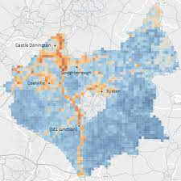

```{r include=FALSE}
library(RefManageR)
library(knitcitations)
BibOptions(check.entries = FALSE,
           bib.style = "authoryear",
           cite.style = "authoryear",
           style = "markdown",
           hyperlink = TRUE,
           dashed = FALSE,
           no.print.fields=c("doi", "url", "urldate", "issn"))
myBib <- ReadBib("./References.bib", check = FALSE)

```


# Problem Definition

- Leicester generates relatively low levels of PM2, but has high rates of avoidable deaths due to poor air quality compared to other UK cities `r Citep(myBib, "centreforcitiesHoldingOurBreath2020")`

- The Leicester council has attributed this to polluted air being blown in from neighbouring cities `r Citep(myBib, "birdLeicesterNamedOne2018")`

```{r echo=FALSE, out.width='40%'}

```
.small[[Source: Leicestershire City Council](https://politics.leics.gov.uk/documents/s155032/Appendix%20-%20Air%20Quality%20Action%20Plan.pdf)
]


---
# Problem Definition


y


---
class: inverse, center, middle

# x 


---
# Approach
## Methods - Site Suitablity Analysis
Using existing data to identify the optimal locations for future forests within and around the city of Leicester, UK. 

```{r echo=FALSE}
DiagrammeR::grViz("digraph {
  
graph[layout = dot, rankdir = LR]

a [label = 'Suitable Site', shape = square, fillcolor = Black]
c [label = 'Prevlaining Wind Direction']
b [label = 'Pollution Concentration']
d [label = 'Existing infrastructure']


{b c d} -> a
}")
```


---
# Approach - Data
## Pollution Concentration


.pull-left[
image of air quality
]


.pull-right[
text here
]

---
# Approach - Data
## Prevailing Wind Direction


---
# Approach - Data
## Existing Infrastructure

x
---
# Approach
## Limitation


---
# Return on Investment
- Reduction in premature mortality, reduced burden on healthcare (NHS) leading to savings in related departments (cardiovascular?).
- Increase in housing prices near to forests `r Citep(myBib, "daams2019")`.
- Licencing code to other cities, allowing them to fix their issues with neighbouring pollution. 

---
# Project Plan

```{r echo=FALSE}
devtools::install_github('Kitware/candela', subdir='R/candela', dependencies = TRUE)

library(candela)

data <- list(
  list(name='Do this', level=1, start=0, end=5),
  list(name='This part 1', level=2, start=0, end=3),
  list(name='This part 2', level=2, start=3, end=5),
  list(name='Then that', level=1, start=5, end=15),
  list(name='That part 1', level=2, start=5, end=10),
  list(name='That part 2', level=2, start=10, end=15))

candela('GanttChart',
        data=data, label='name',
        start='start', end='end', level='level',
        width=700, height=200)

```


---
# Project Plan

```{r echo=FALSE}
library(DiagrammeR)

mermaid("
gantt
dateFormat  YYYY-MM-DD
title A Very Nice Gantt Diagram

section Basic Tasks
This is completed             :done,          first_1,    2014-01-06, 2014-01-08
This is active                :active,        first_2,    2014-01-09, 3d
Do this later                 :               first_3,    after first_2, 5d
Do this after that            :               first_4,    after first_3, 5d

section Important Things
Completed, critical task      :crit, done,    import_1,   2014-01-06,24h
Also done, also critical      :crit, done,    import_2,   after import_1, 2d
Doing this important task now :crit, active,  import_3,   after import_2, 3d
Next critical task            :crit,          import_4,   after import_3, 5d

section The Extras
First extras                  :active,        extras_1,   after import_4,  3d
Second helping                :               extras_2,   after extras_1, 20h
More of the extras            :               extras_3,   after extras_1, 48h
")
```


---
# Integration to business as usual
## Existing teams? 

[Existing tree strategy](https://www.leicester.gov.uk/content/tree-strategy-21-22/)
